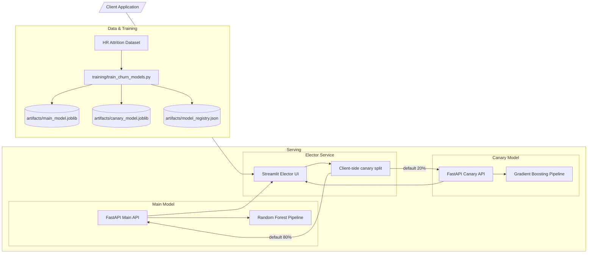

# ML Churn Deployment Project

This repository packages everything needed to train, evaluate, and deploy churn (employee attrition) models with FastAPI, Docker, Docker Compose, Minikube, and Google Kubernetes Engine (GKE). Traffic is split between a main model and a canary model using a Streamlit-based Elector UI that applies a configurable canary split.

## Architecture diagram



## Project Overview

- **Main model** (`main_model/`): Random Forest churn pipeline exported as `artifacts/main_model.joblib`.
- **Canary model** (`canary_model/`): Gradient Boosting challenger exported as `artifacts/canary_model.joblib`.
- **Elector service** (`elector/`): Streamlit UI that sends each request to either model based on a canary split (`CANARY_TRAFFIC_PERCENT`).
- **Shared utilities** (`common/`): Feature schema, preprocessing helpers, and centralized path definitions.
- **Kubernetes manifests** (`k8s/`): Deployments, services, and namespace resources for Minikube or GKE.
- **Artifacts & registry** (`artifacts/`): Persisted models plus `model_registry.json` with metrics to guide rollout decisions.

## Repository Structure

```
├── artifacts/
│   ├── canary_model.joblib           # Challenger pipeline
│   ├── main_model.joblib             # Primary pipeline
│   └── model_registry.json           # Metrics logged after training
├── canary_model/
│   ├── app.py                        # FastAPI service exposing /predict
│   └── Dockerfile                    # Container for canary API
├── common/
│   ├── churn_config.py               # Paths, feature lists, constants
│   ├── model_utils.py                # Artifact loading + preprocessing
│   └── schemas.py                    # Pydantic request schema
├── elector/
│   ├── app.py                        # Weighted router with retries
│   └── Dockerfile
├── k8s/
│   ├── namespace.yaml
│   ├── model-deployment.yaml
│   ├── model-svc.yaml
│   ├── canary-deployment.yaml
│   ├── canary-svc.yaml
│   ├── elector-deployment.yaml
│   └── elector-svc.yaml
├── main_model/
│   ├── app.py
│   └── Dockerfile
├── training/
│   └── train_churn_models.py         # Retraining entrypoint
├── docker-compose.yml                # Local multi-service run
├── requirements.txt
└── README.md
```

## Model Lifecycle

1. **Dataset**: `HR_Employee_Attrition_Dataset con faltantes.csv` contains categorical and numeric HR attributes with the `attrition` target.
2. **Preprocessing**: Numeric features are imputed + scaled, categorical features are imputed + one-hot encoded (see `common/churn_config.py`).
3. **Training**: `training/train_churn_models.py` fits two pipelines (Random Forest for main, Gradient Boosting for canary), saves artifacts, and updates `artifacts/model_registry.json` with metrics.
4. **Serving**: FastAPI apps load the serialized pipelines, expose `/predict`, `/health`, and `/metadata`, and return churn probabilities.

### Training or refreshing the models

```bash
python3 -m venv .venv
source .venv/bin/activate
pip install -r requirements.txt
python -m training.train_churn_models
```

Artifacts are written to `artifacts/` by default. Override `MODEL_ARTIFACT_PATH` if you store models elsewhere.

### Feature schema

Key request fields include: `age`, `businesstravel`, `dailyrate`, `department`, `distancefromhome`, `education`, `educationfield`, `environmentsatisfaction`, `gender`, `hourlyrate`, `jobinvolvement`, `joblevel`, `jobrole`, `disobediencerules`, `jobsatisfaction`, `maritalstatus`, `monthlyincome`, `monthlyrate`, `numcompaniesworked`, `overtime`, `percentsalaryhike`, `performancerating`, `relationshipsatisfaction`, `stockoptionlevel`, `totalworkingyears`, `trainingtimeslastyear`, `worklifebalance`, `yearsatcompany`, `yearsincurrentrole`, `yearssincelastpromotion`, `yearswithcurrmanager`.

## Getting Started

### Prerequisites

- Google Cloud Platform project with billing enabled.
- Google Cloud SDK (`gcloud`).
- Docker Engine + Docker Compose plugin.
- Python 3.9+ with `pip` and `venv`.
- kubectl and Minikube (for local clusters).
- Artifact Registry API enabled if you push images to GCP.

### Setting Up GCP VM (optional but recommended)

```bash
export PROJECT_ID=<YOUR_GCP_PROJECT_ID>
export LOCATION=<YOUR_GCP_REGION>               # e.g., us-central1
export REPOSITORY=<YOUR_ARTIFACT_REGISTRY_REPO>

gcloud compute instances create ml-deployment-vm \
  --project=$PROJECT_ID \
  --zone=$LOCATION-a \
  --machine-type=e2-standard-4 \
  --image-family=ubuntu-2204-lts \
  --image-project=ubuntu-os-cloud \
  --boot-disk-type=pd-ssd \
  --boot-disk-size=50GB \
  --scopes=https://www.googleapis.com/auth/cloud-platform

gcloud compute instances add-labels ml-deployment-vm \
  --project=$PROJECT_ID \
  --zone=$LOCATION-a \
  --labels=environment=development,project=churn-demo

gcloud compute firewall-rules create allow-minikube-dashboard \
  --project=$PROJECT_ID \
  --direction=INGRESS \
  --priority=1000 \
  --network=default \
  --action=ALLOW \
  --rules=tcp:30000-32767 \
  --source-ranges=0.0.0.0/0 \
  --target-tags=ml-deployment-vm

gcloud compute instances add-tags ml-deployment-vm \
  --project=$PROJECT_ID \
  --zone=$LOCATION-a \
  --tags=ml-deployment-vm

gcloud compute ssh ml-deployment-vm --project=$PROJECT_ID --zone=$LOCATION-a
```

### Installing Dependencies

```bash
sudo apt-get update
sudo apt-get install -y apt-transport-https ca-certificates curl gnupg lsb-release
curl -fsSL https://download.docker.com/linux/ubuntu/gpg | sudo gpg --dearmor -o /usr/share/keyrings/docker-archive-keyring.gpg
echo \
  "deb [arch=amd64 signed-by=/usr/share/keyrings/docker-archive-keyring.gpg] https://download.docker.com/linux/ubuntu \
  $(lsb_release -cs) stable" | sudo tee /etc/apt/sources.list.d/docker.list > /dev/null
sudo apt-get update && sudo apt-get install -y docker-ce docker-ce-cli containerd.io docker-compose-plugin
sudo usermod -aG docker $USER && newgrp docker

sudo apt-get install -y python3 python3-pip python3.10-venv
```

### Running Locally (uvicorn/streamlit processes)

1. Clone the repo and enter it:
   ```bash
   git clone https://github.com/AndresEscobedo/inpulso-ml-churn.git
   cd inpulso-ml-churn
   ```

2. Set up Python virtual environment and install dependencies:
   ```bash
   python3 -m venv .venv
   source .venv/bin/activate
   pip install --upgrade pip
   pip install -r requirements.txt
   ```

3. Generate model artifacts if needed:
   ```bash
   python -m training.train_churn_models  # optional when artifacts already exist
   ```

4. Start each service (use separate terminals or a process manager):
  ```bash
  # Terminal 1: Main model
  uvicorn main_model.app:app --host 0.0.0.0 --port 5000 --reload
   
  # Terminal 2: Canary model
  uvicorn canary_model.app:app --host 0.0.0.0 --port 5001 --reload
   
  # Terminal 3: Streamlit Elector (client-side 80/20 split)
  CANARY_TRAFFIC_PERCENT=20 streamlit run elector/streamlit_app.py --server.address 0.0.0.0 --server.port 8501
  ```

5. Open the Streamlit UI at `http://localhost:8501` to compare models and send predictions (each request is routed to a single model according to the split).

### Running with Docker Compose

1. Confirm `artifacts/main_model.joblib` and `artifacts/canary_model.joblib` exist (run the training script if not).

2. Build and start all services:
   ```bash
   docker compose up --build
   ```

3. Override the client-side routing weight when needed:
  ```bash
  CANARY_TRAFFIC_PERCENT=10 docker compose up elector
  ```

4. Open the Streamlit UI at `http://localhost:8501` to send predictions.

## Kubernetes Deployment

### Setting Up Minikube

```bash
curl -LO https://storage.googleapis.com/minikube/releases/latest/minikube-linux-amd64
sudo install minikube-linux-amd64 /usr/local/bin/minikube
curl -LO "https://dl.k8s.io/release/$(curl -L -s https://dl.k8s.io/release/stable.txt)/bin/linux/amd64/kubectl"
sudo install -o root -g root -m 0755 kubectl /usr/local/bin/kubectl
minikube start --driver=docker --cpus=4 --memory=8g --disk-size=20g
kubectl get nodes
```

### Building and loading images for Minikube

```bash
docker build -t churn-main:latest -f main_model/Dockerfile .
docker build -t churn-canary:latest -f canary_model/Dockerfile .
docker build -t churn-elector:latest -f elector/Dockerfile .
minikube image load churn-main:latest
minikube image load churn-canary:latest
minikube image load churn-elector:latest
```

Update the deployment manifests to reference these local tags and set `imagePullPolicy: Never` when using Minikube's Docker daemon.

### Deploying to Kubernetes

```bash
kubectl apply -f k8s/namespace.yaml
kubectl apply -f k8s/model-deployment.yaml -n churn
kubectl apply -f k8s/model-svc.yaml -n churn
kubectl apply -f k8s/canary-deployment.yaml -n churn
kubectl apply -f k8s/canary-svc.yaml -n churn
kubectl apply -f k8s/elector-deployment.yaml -n churn
kubectl apply -f k8s/elector-svc.yaml -n churn
kubectl get deployments -n churn
kubectl get pods -n churn
kubectl get svc -n churn
```

### Testing the deployment

```bash
NODE_PORT=$(kubectl get svc elector -n churn -o jsonpath='{.spec.ports[0].nodePort}')
ELECTOR_IP=$(minikube ip)
echo "Open http://$ELECTOR_IP:$NODE_PORT to use the Streamlit Elector UI (default split 80/20)."
```

Use `kubectl logs deployment/elector -n churn` if UI calls fail, and `minikube service elector -n churn --url` to obtain a tunnelled URL when NodePort access is blocked.

### Adjusting routing weights in-cluster

Edit `k8s/elector-deployment.yaml` and change the `CANARY_TRAFFIC_PERCENT` environment variable. Re-apply and wait for the rollout:

```bash
kubectl apply -f k8s/elector-deployment.yaml -n churn
kubectl rollout status deployment/elector -n churn
```

## Deploying to Google Cloud Platform (GCP)

### 1. Environment variables

```bash
export PROJECT_ID=inbest-transformation
export LOCATION=us-central1
export REPOSITORY=nadro-demo
export CLUSTER_NAME=nadro-demo-ml
```

> **Placeholder guide:**
> - Ensure the values you choose for `PROJECT_ID`, `LOCATION`, `REPOSITORY`, and `CLUSTER_NAME` exist in your GCP account.
> - Update the Kubernetes manifests so the placeholder image strings (`REGION-docker.pkg.dev/PROJECT_ID/REPOSITORY/<service>:IMAGE_TAG`) match the Artifact Registry images you build.
> - Replace `YOUR_ALLOWED_CIDR` inside `k8s/elector-svc.yaml` with the CIDR blocks that should reach the LoadBalancer (or remove the section to allow all traffic).

### 2. Create the GKE cluster

```bash
gcloud services enable container.googleapis.com
gcloud container clusters create $CLUSTER_NAME \
  --project=$PROJECT_ID \
  --zone=$LOCATION-a \
  --machine-type=e2-standard-2 \
  --num-nodes=3 \
  --disk-size=40 \
  --disk-type=pd-standard \
  --release-channel=regular
gcloud container clusters get-credentials $CLUSTER_NAME --zone=$LOCATION-a --project=$PROJECT_ID
kubectl get nodes
```

### 3. Configure Artifact Registry

```bash
gcloud services enable artifactregistry.googleapis.com
gcloud artifacts repositories create $REPOSITORY \
  --repository-format=docker \
  --location=$LOCATION \
  --description="Churn model containers"
gcloud auth configure-docker $LOCATION-docker.pkg.dev
```

### 4. Build and push container images (Cloud Build)

```bash
IMAGE_TAG=latest
MAIN_IMAGE=$LOCATION-docker.pkg.dev/$PROJECT_ID/$REPOSITORY/main-model:$IMAGE_TAG
CANARY_IMAGE=$LOCATION-docker.pkg.dev/$PROJECT_ID/$REPOSITORY/canary-model:$IMAGE_TAG
ELECTOR_IMAGE=$LOCATION-docker.pkg.dev/$PROJECT_ID/$REPOSITORY/elector:$IMAGE_TAG

gcloud services enable cloudbuild.googleapis.com

gcloud builds submit \
  --config main_model/cloudbuild.yaml \
  --substitutions=_REGION=$LOCATION,_REPOSITORY=$REPOSITORY,_IMAGE_TAG=$IMAGE_TAG \
  .

gcloud builds submit \
  --config canary_model/cloudbuild.yaml \
  --substitutions=_REGION=$LOCATION,_REPOSITORY=$REPOSITORY,_IMAGE_TAG=$IMAGE_TAG \
  .

gcloud builds submit \
  --config elector/cloudbuild.yaml \
  --substitutions=_REGION=$LOCATION,_REPOSITORY=$REPOSITORY,_IMAGE_TAG=$IMAGE_TAG \
  .
```

Each submission builds the Docker image inside Cloud Build and pushes it automatically to Artifact Registry using the substituted tag.

### 5. (Optional) Create pull secrets

```bash
gcloud iam service-accounts create artifact-registry-reader \
  --display-name="Artifact Registry Reader"
gcloud projects add-iam-policy-binding $PROJECT_ID \
  --member="serviceAccount:artifact-registry-reader@$PROJECT_ID.iam.gserviceaccount.com" \
  --role="roles/artifactregistry.reader"
gcloud iam service-accounts keys create key.json \
  --iam-account=artifact-registry-reader@$PROJECT_ID.iam.gserviceaccount.com

kubectl create namespace churn || true
kubectl create secret docker-registry gcp-artifact-registry \
  --namespace=churn \
  --docker-server=$LOCATION-docker.pkg.dev \
  --docker-username=_json_key \
  --docker-password="$(cat key.json)" \
  --docker-email=example@example.com
rm key.json
```

Add the following to `spec.template.spec` of each deployment when using the secret:

```yaml
imagePullSecrets:
  - name: gcp-artifact-registry
```

### 6. Update Kubernetes manifests

```bash
sed -i "s|REGION-docker.pkg.dev/PROJECT_ID/REPOSITORY/main-model:IMAGE_TAG|$MAIN_IMAGE|g" k8s/model-deployment.yaml
sed -i "s|REGION-docker.pkg.dev/PROJECT_ID/REPOSITORY/canary-model:IMAGE_TAG|$CANARY_IMAGE|g" k8s/canary-deployment.yaml
sed -i "s|REGION-docker.pkg.dev/PROJECT_ID/REPOSITORY/elector:IMAGE_TAG|$ELECTOR_IMAGE|g" k8s/elector-deployment.yaml
```

### 7. Deploy to GKE

```bash
kubectl apply -f k8s/namespace.yaml
kubectl apply -f k8s/model-deployment.yaml -n churn
kubectl apply -f k8s/model-svc.yaml -n churn
kubectl apply -f k8s/canary-deployment.yaml -n churn
kubectl apply -f k8s/canary-svc.yaml -n churn
kubectl apply -f k8s/elector-deployment.yaml -n churn
kubectl apply -f k8s/elector-svc.yaml -n churn
kubectl get pods -n churn
```

### 8. Expose the Elector service

```bash
export MY_IP=$(curl -s ifconfig.me)
kubectl patch svc elector -n churn --type=merge -p "{\"spec\": {\"type\": \"LoadBalancer\", \"loadBalancerSourceRanges\": [\"${MY_IP}/32\"]}}"
kubectl get svc elector -n churn
open http://EXTERNAL_IP
```

### 9. Monitor and audit

```bash
kubectl get pods -n churn
kubectl logs deployment/elector -n churn
kubectl describe pod <pod-name> -n churn
```

## Monitoring and Maintenance

- **Observability**: Export FastAPI + Elector logs to Cloud Logging or an ELK stack; add Prometheus metrics for request latency and routing ratios.
- **Model registry**: Track metric drift in `artifacts/model_registry.json` to justify increasing `CANARY_WEIGHT` or promoting/demoting models.
- **CI/CD**: Automate retraining, image builds, and GKE rollouts with Cloud Build or GitHub Actions.
- **Security**: Lock down Artifact Registry, use workload identity for GKE, and front Elector with an HTTPS ingress or API gateway.

## Cleanup

```bash
minikube stop && minikube delete
kubectl delete namespace churn || true

gcloud compute instances stop ml-deployment-vm --project=$PROJECT_ID --zone=$LOCATION-a
gcloud compute instances delete ml-deployment-vm --project=$PROJECT_ID --zone=$LOCATION-a
gcloud container clusters delete $CLUSTER_NAME --project=$PROJECT_ID --zone=$LOCATION-a
```

## Troubleshooting Common Issues

### ImagePullBackOff errors

```bash
kubectl get pods -n churn
kubectl describe pod <pod-name> -n churn
```

Typical fixes:

1. Verify manifest images reference the tags you built/pushed (e.g., `$MAIN_IMAGE`).
2. For Minikube, set `imagePullPolicy: Never` and keep tags consistent with `minikube image load`.
3. If using private Artifact Registry, confirm the `gcp-artifact-registry` secret exists in the `churn` namespace and appears under `imagePullSecrets`.

### Elector routing does not match expected weights

- Fetch `/health` from the Elector service to read the active `canary_weight`.
- Inspect logs with `kubectl logs deployment/elector -n churn` to confirm which model served each request.
- After changing `CANARY_WEIGHT`, run `kubectl rollout restart deployment/elector -n churn` so pods pick up the new environment variable.
- Ensure the canary and main services report `status: healthy`; the Elector will fall back to available models when one fails, which can skew routing percentages.

## License

This project is licensed under the MIT License - see the LICENSE file for details.
